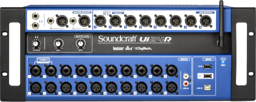

# ui24rsc



[](https://github.com/dmotte/ui24rsc/actions)
[](https://pypi.org/project/ui24rsc/)

:snake: **Ui24R** **S**napshot **C**onverter.

The official Soundcraft Ui24R JSON snapshot export format is very hard to understand and work with; thus, manually editing mixer snapshots from code can be extremely uncomfortable. This Python script lets you convert snapshots exported from the mixer Web UI to other more human-readable formats and vice versa. It can read/write both _JSON_ and _YAML_ documents.

> **Note**: this project is specific for **Soundcraft JSON snapshot format**, a.k.a. "_Offline Files_". It does not handle `.uisnapshot` files.

Tested with firmware version **3.3.8293-ui24**.

## Installation

This utility is available as a Python package on **PyPI**:

```bash
pip3 install ui24rsc
```

## Usage

The first parameter of this command is `ACTIONS`, a **comma-separated sequence of operations** which will be used in order to process the input document and produce the output. See [the code](ui24rsc/cli.py) for more information on what each action does.

This is a basic example of how to convert from official Soundcraft JSON format to a custom tree-like, human-friendly, differential YAML format:

```bash
ui24rsc diff,tree original.json human-friendly.yml
```

And the opposite is:

```bash
ui24rsc dots,full human-friendly.yml official.json
```

:information_source: For more details on how to use this command, you can also refer to the help message (`ui24rsc --help`).

## Development

If you want to contribute to this project, you can install the package in **editable** mode:

```bash
pip3 install -e . --user
```

This will just link the package to the original location, basically meaning any changes to the original package would reflect directly in your environment ([source](https://stackoverflow.com/a/35064498)).

If you want to run the tests, you'll have to install the `pytest` package and then run:

```bash
pytest test
```

## Other useful stuff

The [`default-init.yml`](ui24rsc/default-init.yml) file was built by exporting the `* Init *` snapshot (from the `Default` show of the Soundcraft Ui24R), which should contain the mixer factory default settings, and then executing the following command:

```bash
ui24rsc tree,sort default-init.json default-init.yml
```

If you want to check that the two files are equivalent, you can install [`jq`](https://stedolan.github.io/jq/) on your PC and then run:

```bash
diff <(jq --sort-keys < default-init.json) <(ui24rsc dots default-init.yml | jq --sort-keys)
```

In general, if you want to see the differences between two snapshot files in different formats, you can use the following command:

```bash
diff <(jq --sort-keys < snapshot01.json) <(ui24rsc dots,full snapshot01.yml | jq --sort-keys)
```
